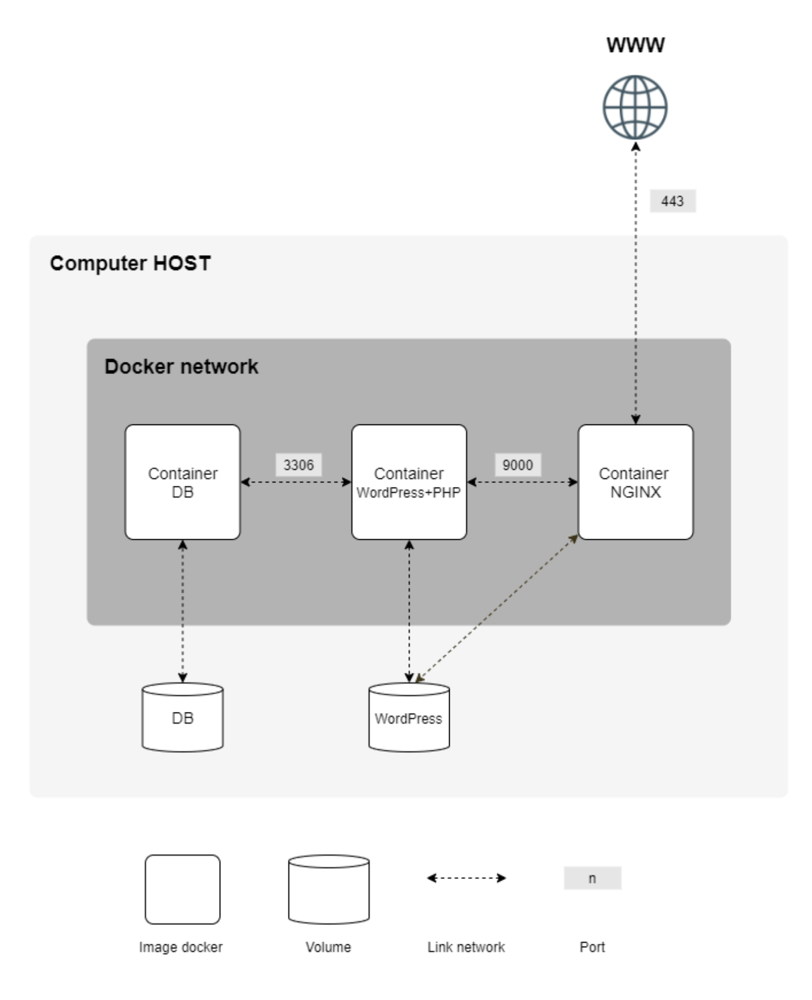

# 🐳 Inception - 42 Project


## 📚 Description

**Inception** is a system administration and DevOps project from the 42 School curriculum. The main objective is to build a secure and scalable web server infrastructure using Docker. The project includes deploying a WordPress site with a MariaDB database behind an NGINX reverse proxy, all managed via Docker Compose.

---

## 🧱 Stack

- [Docker](https://www.docker.com/)
- [Docker Compose](https://docs.docker.com/compose/)
- [NGINX](https://www.nginx.com/)
- [WordPress](https://wordpress.org/)
- [MariaDB](https://mariadb.org/)
- [OpenSSL](https://www.openssl.org/)

---

## 🖼️ Architecture



---

## 🚀 Build and Run the Containers

Before starting the project, create the necessary local directories for persistent volume storage:

```bash
mkdir -p $HOME/database $HOME/data
```

Then, clone the repository and navigate into it:

```bash
git clone https://github.com/hassanlakhal/inception.git
cd inception
```

Now, build and run the containers using:

```bash
make
```

Once the setup is complete, open your browser and visit:

```
https://<your-domain-name>
```

For example:

```
https://hlakhal.42.fr
```
> ⚠️ Replace `<your-domain-name>` with the actual domain configured in your `.env` and NGINX setup and in file hosts in /etc.